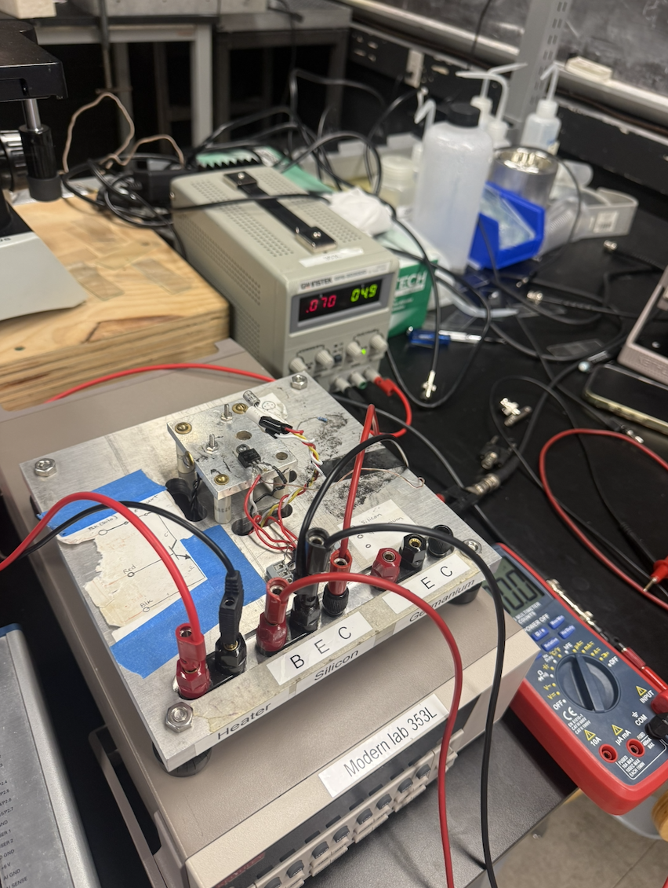
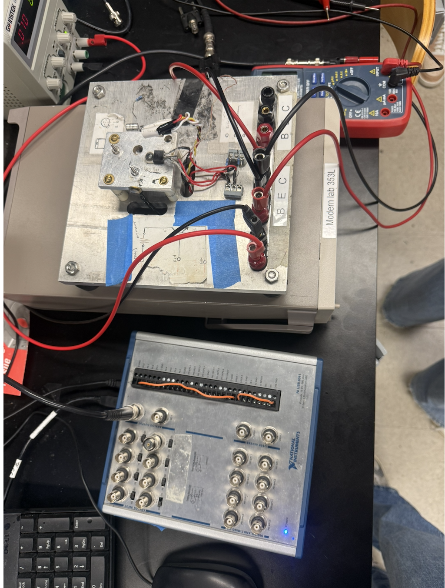
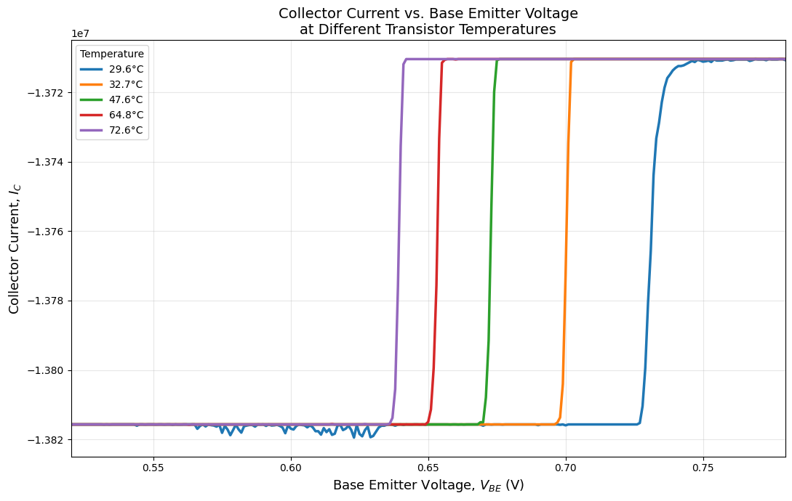
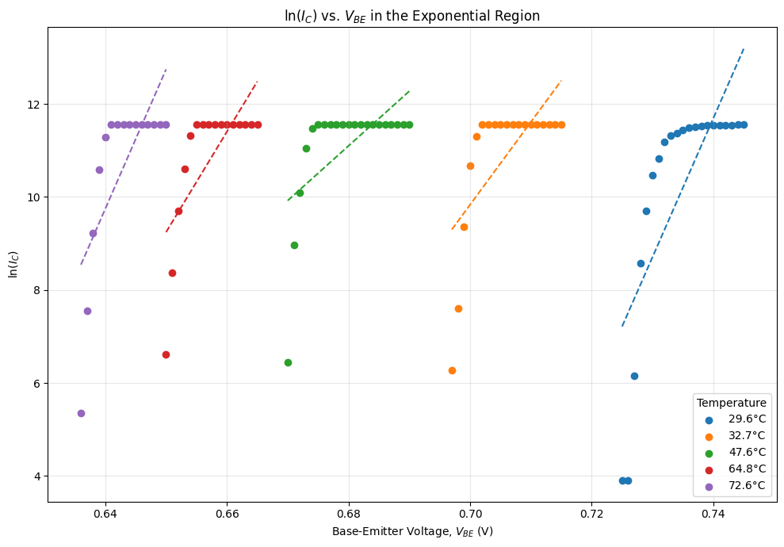

# Semiconductor Physics Lab

## Overview
Characterized temperature dependent semiconductor behavior using experimental measurements, Python data analysis, curve fitting, and theoretical modeling.

This project was completed as part of an experimental physics laboratory and focused on connecting semiconductor theory with measured laboratory data.

## Project Highlights

- Collected and analyzed experimental semiconductor measurements across varying temperatures.
- Used Python to process, visualize, and fit experimental data.
- Compared experimental behavior with theoretical semiconductor models.
- Evaluated uncertainty and sources of experimental error.
- Produced technical plots to communicate experimental results.

## Tools & Skills

- Python
- NumPy
- Matplotlib
- SciPy
- Experimental Data Analysis
- Curve Fitting
- Uncertainty Analysis
- Semiconductor Physics

## Experimental Setup

A semiconductor transistor was measured under controlled temperature conditions to study how its electrical behavior changed with temperature. Laboratory instrumentation was used to control the circuit and collect measurements for later analysis in Python.

## Results

### Temperature Dependence

Measurements were collected across multiple temperatures to characterize the temperature dependent behavior of the semiconductor.

### Exponential Region Analysis

Collector current data were transformed using ln(Ic) and linear fits were applied within the exponential region to analyze the relationship between collector current and base emitter voltage at different temperatures.

## Repository Structure

- `data/` — Experimental data
- `figures/` — Generated plots and figures
- `images/` — Experimental setup photos
- `analysis/` — Python analysis code
